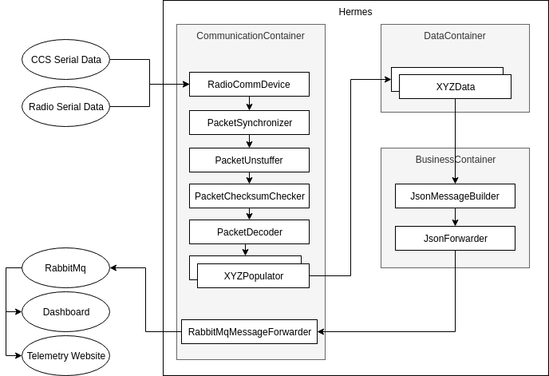
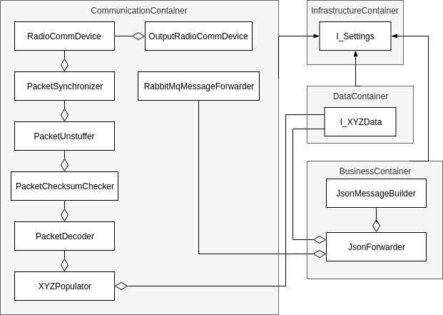

= README

Hermes is a background process on the Schulich Elysia's onboard computer.
It rebroadcasts a data feed from the Central Communication System and also logs the data.

The name is inspired by the Olympian god Hermes who is portrayed as a messenger and scribe of the gods.

== Connecting to Serial Ports

=== Serial Port
In the config.ini file, there is a  `SerialPort` section:
```
[SerialPort]
portName=/dev/pts/7
baudrate=115200
```
* `portName` - path to the serial port (either CCS, XBee, or a virtual serial port)
** On debian based distros, physical devices can be found in `/dev/`, e.g `/dev/ttyUSB0`. Plug/Unplug the device as needed to find it
* `baudrate` - the rate the information is sent
** Ensure that both ends of communication (CCS/Test Tool/XBee) have the same baudrate.
*** CCS & Test Tool is set in source code
*** XBees are configured using XCTU

=== Output Serial Port

To have Hermes forward its input serial port to another one (eg. forward CSS serial data to an XBee), use the `OutputSerialPort` section.

```
[OutputSerialPort]
outputSerialEnabled=true
portName=/dev/ttyUSB0
baudrate=115200
```

* `outputSerialEnabled` - Set true to enable forwarding
* `portName` - Set to the path of the output port
* `baudrate` - Baudrate of the information, will likely match the baudrate of the input port

== Project Setup

In this repo, there are dependencies needed before you will be able to build or run anything.

If you don't already have conan and RabbitMQ installed from another project, run the setup script:

`./EpsilonHermesSetup.sh`

This will install the https://www.rabbitmq.com/[RabbitMQ] server and the https://conan.io/[Conan] package manager. See the links for more information.

== Building

=== QT Creator

When first setting up your project with QT creator, you must first add a custom step to allow Conan to install dependencies.

1. Navigate to `Projects -> Build`
2. In `Build Steps`, select `Add Build Step -> Custom Process Step`
3. Add the conan command to the step
   - Command: `$HOME/.local/bin/conan`
   - Arguments: `install ../conanfile.txt --build=missing -s compiler.libcxx="libstdc++11"`
   - Working Directory: `%{buildDir}`
4. Move the step to occur as the first step in the process

=== Command Line

1. Create a new directory for your build & navigate into it:

    `mkdir build && cd build`

2. If you were running this on the same terminal you ran the setup script on, reload your environment:
   `source ~/.profile`

3. Install conan dependencies:

    `conan install ../conanfile.txt --build=missing -s compiler.libcxx="libstdc++11"`

4. Call qmake, passing in the directory with the path to the root `EpsilonDashboard.pro` to generate the makefile:

    `qmake ../src/EpsilonDashboard.pro`

- Later, if you need to re-run qmake on the project due to a new UI file or a change to a .pro, call:

    `make qmake_all`

5. Build:

    `make -j4`

== Misc Notes

=== Useful RabbitMQ Server Commands

==== Start Server

`sudo rabbitmq-server` can be used to start the server on Linux.

==== Refresh Server

On linux to refresh the contents of the server perform the following commands:

`rabbitmqctl stop_app`

`rabbitmqctl reset`

`rabbitmqctl start_app`

=== Testing

Testing Hermes is done with googletest and googlemock.

Run `make check` in your build directory to run the tests.

== Architecture

=== DataFlow


=== Class Diagram

